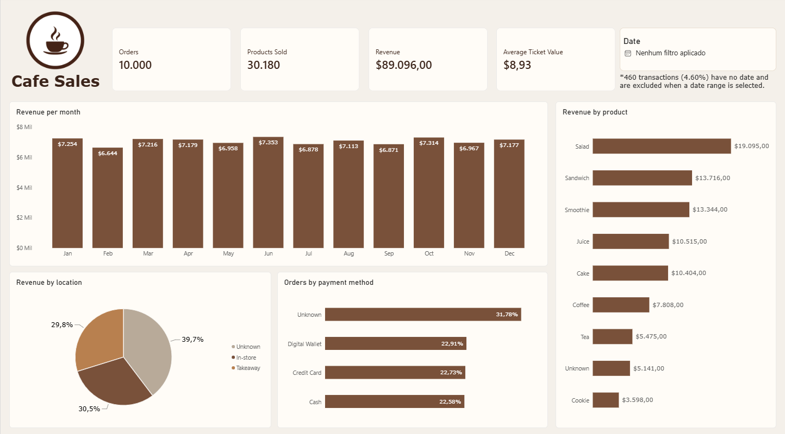
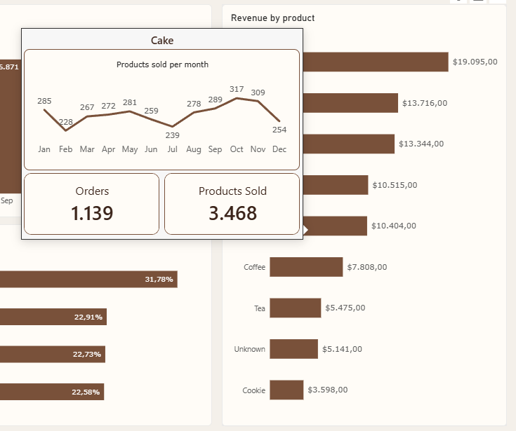

# Cafe Sales — Python, PostgreSQL e Power BI

Projeto de portfólio que acompanha 10.000 transações de uma cafeteria: investigação
e limpeza em Python, carga e validação no PostgreSQL e análise interativa no Power BI.
O foco é explicar as decisões de tratamento e seus efeitos nos indicadores.



## Perguntas da análise

- Como receita e unidades vendidas variam ao longo dos meses?
- Quais produtos geram mais receita e volume?
- Como as vendas se distribuem entre consumo na loja e para viagem?
- Qual é a participação dos métodos de pagamento em receita e pedidos?
- Como informações ausentes afetam a leitura dos resultados?

## Fonte dos dados

[Cafe Sales — Dirty Data for Cleaning Training](https://www.kaggle.com/datasets/ahmedmohamed2003/cafe-sales-dirty-data-for-cleaning-training),
publicado por Ahmed Mohamed no Kaggle, sob **CC BY-SA 4.0**.
Licença confirmada nos metadados públicos do Kaggle em 29/09/2026.
É uma base de treinamento; os resultados são exploratórios e não representam
impacto comprovado em uma empresa real. Detalhes de atribuição em [DATA_LICENSE.md](DATA_LICENSE.md).

## Fluxo do projeto

**CSV original → pandas/NumPy → PostgreSQL → Power BI**

O notebook mantém o percurso de estudo. A entrada original é preservada; os
tratamentos são feitos em `df_limpo`. A carga usa uma cópia com nomes de colunas
compatíveis com a tabela SQL, dentro de uma transação e sem substituir o esquema.

### Decisões de limpeza

- Converter campos numéricos e tratar `UNKNOWN`, `ERROR` e nulos como ausências.
- Verificar a relação quantidade × preço = total antes de recuperar valores.
- Recuperar um campo numérico a partir dos outros dois, respeitando quantidades inteiras.
- Preencher preços por produto somente quando existe um único preço observado.
- Repetir a recuperação aritmética após preencher esses preços.
- Inferir produtos desconhecidos apenas nos preços exclusivos do catálogo observado:
  1,00 (Cookie), 1,50 (Tea), 2,00 (Coffee) e 5,00 (Salad). Isso pressupõe que o catálogo
  e os preços observados também valem para as vendas incompletas. Preços 3,00 e 4,00
  são ambíguos e não identificam o produto.
- Manter ausências sem evidência suficiente, em vez de inventar valores ou excluir vendas.
- Converter datas válidas e conservar datas desconhecidas como `NaT`/`NULL`.
- Representar categorias desconhecidas por “Não informado”; no Power Query, traduzi-las
  para “Unknown” na apresentação em inglês.

### Qualidade final

| Campo | Valores desconhecidos | % das 10.000 transações |
|---|---:|---:|
| Quantity | 23 | 0,23% |
| Price Per Unit | 6 | 0,06% |
| Total Spent | 23 | 0,23% |
| Transaction Date | 460 | 4,60% |
| Item | 480 | 4,80% |
| Payment Method | 3.178 | 31,78% |
| Location | 3.961 | 39,61% |

Há **26 transações (0,26%)** com pelo menos um campo numérico ausente. As contagens
por coluna se sobrepõem e não devem ser somadas como se fossem transações distintas.

## Resultados e definição dos indicadores

| Indicador | Base completa, sem filtros |
|---|---:|
| Pedidos | 10.000 |
| Unidades conhecidas vendidas | 30.180 |
| Receita conhecida | 89.096,00 |
| Ticket médio | 8,93 |

- **Pedidos:** IDs distintos; cada linha desta base tem um ID único.
- **Unidades e receita:** soma dos valores conhecidos.
- **Ticket médio:** média dos totais conhecidos, usando 9.977 transações na base completa.
  Não é a receita dividida por todas as 10.000 transações nem uma média simples dos tickets por produto.
- **Período:** as datas válidas vão de janeiro a dezembro de 2023. Selecionar todo esse
  intervalo exclui as 460 transações sem data: ficam 9.540 pedidos, 28.754 unidades e
  84.922,50 de receita. Limpar o filtro de data permite voltar aos totais gerais.

O símbolo `$` utilizado no relatório é uma escolha de apresentação; a moeda não foi
confirmada nesta documentação. Os valores não devem ser apresentados como BRL ou USD
sem verificar a descrição da fonte.

Salad lidera a receita conhecida (19.095,00), enquanto Coffee lidera unidades (3.904).
Na comparação entre junho e outubro, outubro tem mais unidades, mas menor receita
e ticket médio. A composição das vendas por produto ajuda a investigar essa diferença;
não estabelece causalidade. As categorias desconhecidas limitam conclusões sobre
preferências de pagamento, local e produto.

## Arquivos

| Arquivo | Conteúdo |
|---|---|
| `Limpeza_Estruturação.ipynb` | Investigação, limpeza, validações e carga |
| `1.dirty_cafe_sales.csv` | Entrada original, com nome local usado no notebook |
| `cafe_sales_db.sql` | Criação da tabela `public.vendas` |
| `01_criacao_tabela.sql` | Apesar do nome histórico, contém análise por produto de junho e outubro |
| `Consultas.sql` | Agregações por pagamento, local e produto |
| `validacao_carga.sql` | Conferência de contagens, nulos e indicadores |
| `Dashboard.pbix` | Relatório Power BI com dados importados |
| `dashboard.png` | Visão geral do dashboard sem filtro de datas |
| `tooltip-produto.png` | Detalhamento de Cake na tooltip de produtos |
| `requirements.txt` | Versões de bibliotecas observadas no ambiente do projeto |

As capturas foram fornecidas pelo autor para apresentar o dashboard e a tooltip.
Logo e ilustração foram gerados com auxílio de IA.

## Como reproduzir

1. Instale Python, PostgreSQL e Power BI Desktop. Ambiente observado: Python 3.14 e PostgreSQL 18.
2. Abra um terminal nesta pasta e prepare um ambiente:

   ```powershell
   python -m venv .venv
   .\.venv\Scripts\python.exe -m pip install -r requirements.txt
   ```

3. Abra o notebook no VS Code com a extensão Jupyter e selecione o Python da `.venv`.
   Caso obtenha o CSV diretamente do Kaggle, salve-o nesta pasta com o nome
   `1.dirty_cafe_sales.csv`, esperado pela célula de leitura.
4. No pgAdmin, crie o banco `cafe_sales`. Conectado a ele, execute `cafe_sales_db.sql`
   uma única vez para criar a tabela. A tabela aceita `NULL` em números e datas.
5. Execute o notebook em ordem. Na conexão, ajuste host, porta, usuário e banco para
   sua instalação. A senha é informada por `getpass`; não a escreva no arquivo.
6. Execute a carga com a tabela vazia. O notebook interrompe uma nova carga quando
   ela já contém registros; não é necessário recarregar os dados para fazer consultas.
7. Rode `validacao_carga.sql` e compare com os controles documentados acima.
8. Abra `Dashboard.pbix`. Para atualizar, configure sua própria conexão PostgreSQL em
   **Configurações da fonte de dados**, apontando para `cafe_sales`, e informe suas credenciais.
   O relatório usa Importação; o arquivo contém uma cópia dos dados tratados.

O servidor `localhost` é o computador de quem executa o projeto: o GitHub não hospeda
o banco e o PBIX não se conecta automaticamente ao computador do autor.

## Dashboard

O relatório combina cartões, receita mensal, ranking de produtos, local de consumo,
pedidos por pagamento, filtro de datas e botão para limpar esse filtro. Páginas de
tooltip detalham o ponto selecionado, com títulos dinâmicos e indicadores contextualizados.



Ao passar o mouse sobre um produto, o relatório mostra sua evolução mensal e os
indicadores filtrados para esse item. A imagem apresenta Cake, com 1.139 pedidos e
3.468 unidades conhecidas vendidas, sem filtro de datas.

Os totais mensais incluem somente datas conhecidas e não precisam somar a receita
geral sem filtro. Percentual de transações sem total conhecido não é percentual de
receita perdida. As comparações devem considerar esses limites.
